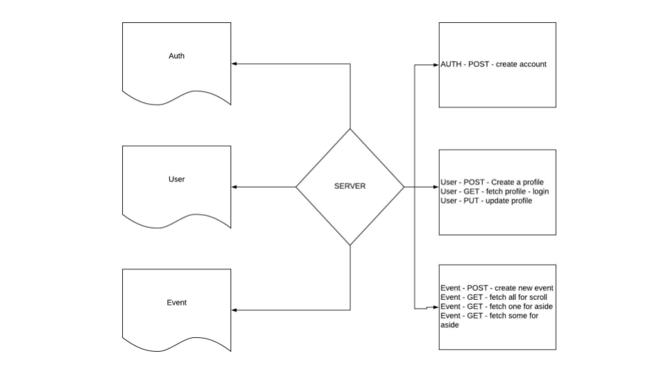

## EventUs Front End

**Authors**: Lacy Hogan, Michael Castor, Ryan Groesch, Sean Miller 
**Version**: 1.0.0

## Overview

This application is designed to be a social media oriented around Events. The concept is that as a user you can sign-up in order to create, view and attend (running and drinking) events that are near the user. 

The original customer is for a local Hashing club to alleviate the need to post in multiple social media platforms, provide a streamlined UI for events in the area near the user and persist the organized data in an efficient manner. 

The application utilizes a MERN Stack (MongoDB, Express.js, React/Redux and Node.js) with OAuthorization to accomplish this. 

## Getting Started

If you would like to use this application please clone both the Front-end and Back-end repositories via git. Once you have a local copy, create a .env file for both repositories and follow the below instructions. 

### In Your Front-end .env File:
    PORT: <PORT_NUMBER_CLIENT>
    API_URL: http://localhost:<PORT_NUMBER_SERVER>
    GOOGLE_API_KEY:<GOOGLE_API_KEY_HERE>

### In Your Back-end .env File:
    NODE_ENV=<ENVIRONMENT>
    PORT=<PORT_NUMBER_SERVER>
    DEBUG=true
    CORS_ORIGINS=http://localhost:<PORT_NUMBER_CLIENT> 
    MONGODB_URI=mongodb://localhost/<DATABASE_NAME>
    SECRET=<SECRET_VALUE>

To install dependencies(both developer and client-side), run the following commands in your CLI(Command Line Interface):

    npm i

The following command will start the server and tell you what port your server is listening on. (Nodemon is used for dynamic loading your client side for rapid development)
    
    nodemon or npm start 

To start the db and test the routes, from the command line, enter:

    npm run dbon 
This turns a local version of MongoDB on

    npm run test 
Enter this line in a separate command line tab. This initiates the tests via the jest testing suite.

    npm run dboff 
This turns off the localized MongoDB.

## Architecture
This application's front-end is running using the following technology: 
- Vanilla JavaScript, React, Redux, Babel, Webpack, dotenv, prop-types, superagent, uuid.
- Back-end: Node.js, body-parser, Express.js, superagent, http-errors, Mongoose (MongoDB) and faker.
- Testing Suites: Enzyme, Jest.

## Change Log
06-18-2018 5:00pm Front-end and Back-end scaffolded and partial functionality completed.
06-18-2018 6:00pm First deployment successful.
06-19-2018 5:00pm Communication between Front-end and Back-end achieved. (bugs discovered and logged)
06-20-2018 5:00pm Application functional up to infinite scroll feature. Sign-up, Login, add new event, authorization and editing of users built in. Styling has been added to completed features. 
06-21-2018 5:00pm MVP product has been launched to new domain. 

## Credits and Collaborations
Collective thanks to all of the Teacher's Assistants, Vinicio and the other staff at Code Fellows.

## Workflow

#### Entity-Relationship (ER) Model

